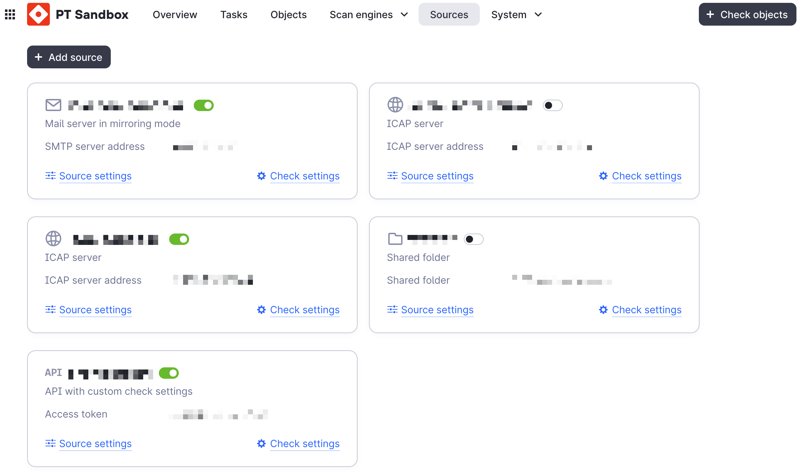
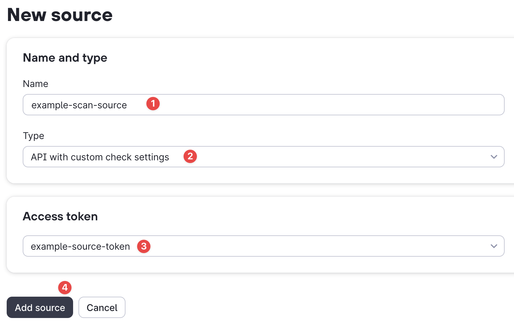

## Overview

The sandbox lets you create scan sources with pre-configured scan settings.



To do this, create a source as shown in the example below and select the appropriate API key for it. In our case, `example-source-token`.



!!! note

    The API key must have at least the `Check with source settings` permission.

See the sandbox documentation for additional details.

## Scan files

```py title="Code example (sync scanning)" hl_lines="16"
import asyncio
from pathlib import Path

from ptsandbox import Sandbox, SandboxKey


async def main():
    key = SandboxKey(
        name="test-key-1",
        key="<TOKEN_FOR_SOURCE>",
        host="10.10.10.10",
    )

    sandbox = Sandbox(key)

    report = await sandbox.source_check_file("./malware.exe") # (1)!
    print(report)

asyncio.run(main())
```

1. By default, a short report is returned. For a full report, add the option `short_result=False`

```py title="Code example (async scanning)" hl_lines="16-19 24"
import asyncio
from pathlib import Path

from ptsandbox import Sandbox, SandboxKey


async def main():
    key = SandboxKey(
        name="test-key-1",
        key="<TOKEN_FOR_SOURCE>",
        host="10.10.10.10",
    )

    sandbox = Sandbox(key)

    task = await sandbox.source_check_file(
        "./malware.elf",
        async_result=True,
    )

    report = await sandbox.wait_for_report(
        task,
        wait_time=100,
        scan_with_source=True, # (1)!
    )


asyncio.run(main())
```

1. When using asynchronous requests with a source, you **must pass the option `scan_with_source=True`**, otherwise you will get a 401 error.

::: ptsandbox.sandbox.sandbox.Sandbox.source_check_file

::: ptsandbox.sandbox.api._scan.ScanMixin.source_check_file

## Scan URLs

```py title="Code example (sync scanning)" hl_lines="16"
import asyncio
from pathlib import Path

from ptsandbox import Sandbox, SandboxKey


async def main():
    key = SandboxKey(
        name="test-key-1",
        key="<TOKEN_FOR_SOURCE>",
        host="10.10.10.10",
    )

    sandbox = Sandbox(key)

    report = await sandbox.source_check_url("http://malware.com/file.elf") # (1)!
    print(report)

asyncio.run(main())
```

1. By default, a short report is returned. For a full report, add the option `short_result=False`

```py title="Code example (async scanning)" hl_lines="16-19 24"
import asyncio
from pathlib import Path

from ptsandbox import Sandbox, SandboxKey


async def main():
    key = SandboxKey(
        name="test-key-1",
        key="<TOKEN_FOR_SOURCE>",
        host="10.10.10.10",
    )

    sandbox = Sandbox(key)

    task = await sandbox.source_check_url(
        "http://malware.com/file.elf",
        async_result=True,
    )

    report = await sandbox.wait_for_report(
        task,
        wait_time=100,
        scan_with_source=True, # (1)!
    )


asyncio.run(main())
```

1. When using asynchronous requests with a source, you **must pass the option `scan_with_source=True`**, otherwise you will get a 401 error.

::: ptsandbox.sandbox.sandbox.Sandbox.source_check_url

::: ptsandbox.sandbox.api._scan.ScanMixin.source_check_url

## Check task status

When using `async_result=True`, you can check the status of a scan task using `check_task` (for regular scans) or `source_get_status` (for source scans). To get the full report, use `get_report` or `source_get_report` respectively.

```py title="Code example" hl_lines="8-10"
from uuid import UUID

from ptsandbox import Sandbox, SandboxKey

sandbox = Sandbox(SandboxKey(...))

# Check status of a regular scan
status = await sandbox.check_task(UUID("..."))
print(status.data.status)

# Check status of a source scan
source_status = await sandbox.source_get_status(UUID("..."))
print(source_status.data.status)
```

::: ptsandbox.sandbox.sandbox.Sandbox.check_task

::: ptsandbox.sandbox.sandbox.Sandbox.source_get_status

::: ptsandbox.sandbox.api._scan.ScanMixin.source_get_status

::: ptsandbox.sandbox.api._scan.ScanMixin.source_get_report
